# 65134016_AndroidProgramming
# Sinh viên: Thái Văn Trung – 65134016
Đây là repository dùng để lưu trữ các bài tập cá nhân trong quá trình học tập.
Nội dung bao gồm bài tập lớn, bài tập nhỏ và các phần thực hành trên lớp.
Mục đích chính là phục vụ việc theo dõi, đánh giá và quản lý tiến độ học tập.

## Bài Thi Giữa Kì

  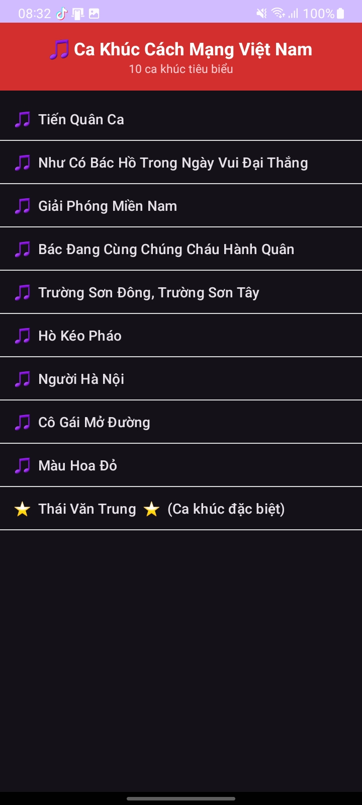
  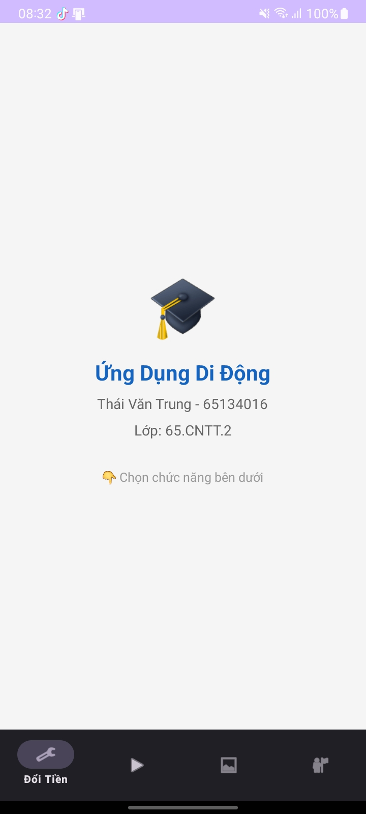
  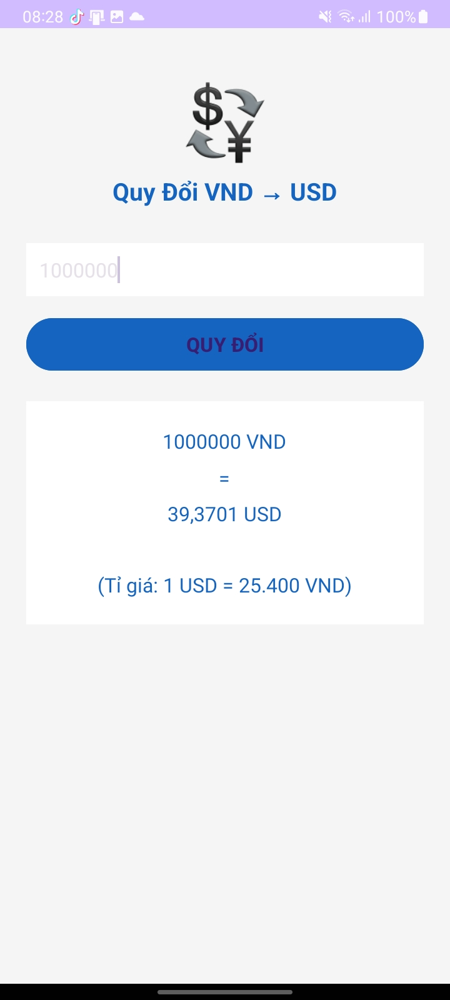

## *Mục lưu trữ bài tập làm thêm:*

## BottomNavigationBar

  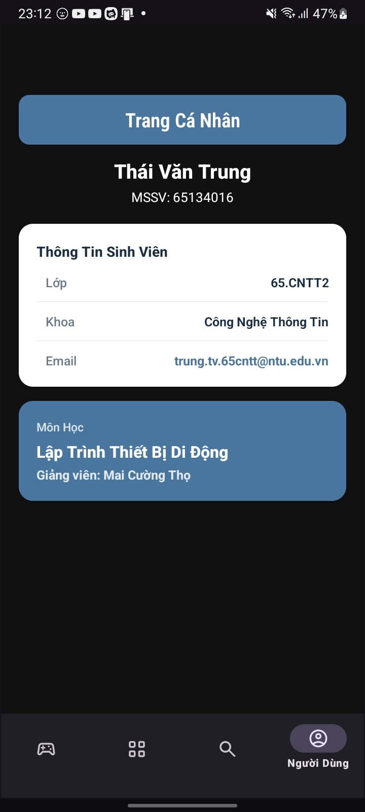
  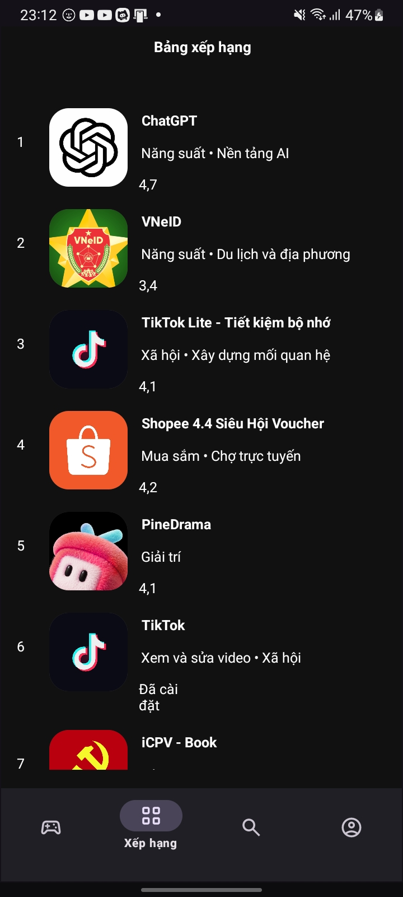
  

---

## Bài tập ôn Giữa Kì

[Chi tiết bài tập](https://github.com/azullshin1109/65134016_AndroidProgramming/tree/main/BaiThiGiuaKi/app/src/main/java/com/thaivantrung/baithigiuaki) | [Layout](https://github.com/azullshin1109/65134016_AndroidProgramming/tree/main/BaiThiGiuaKi/app/src/main/res/layout)

  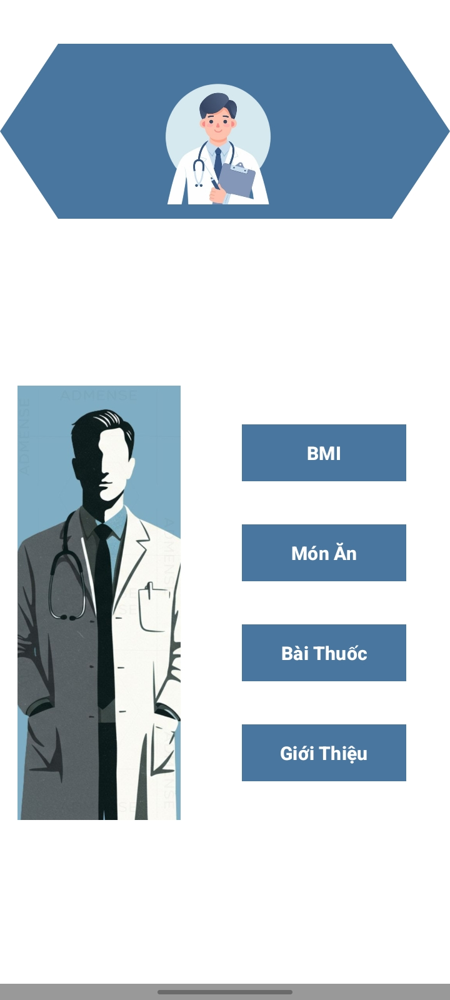
  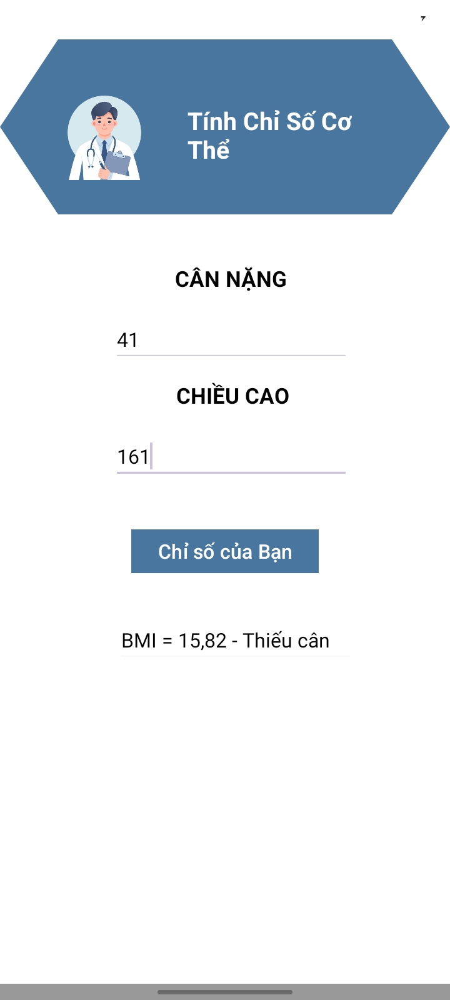
  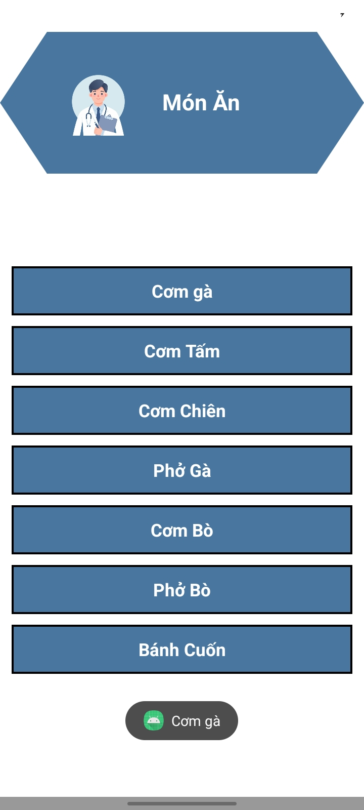
  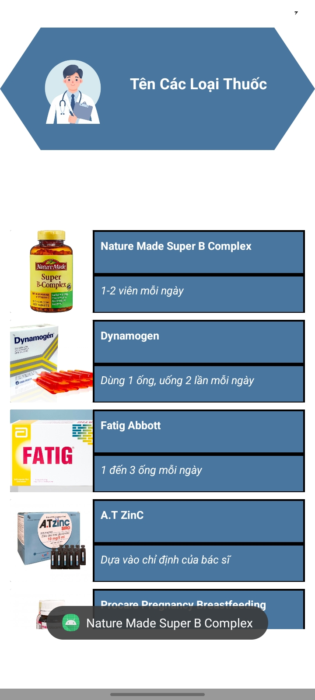
  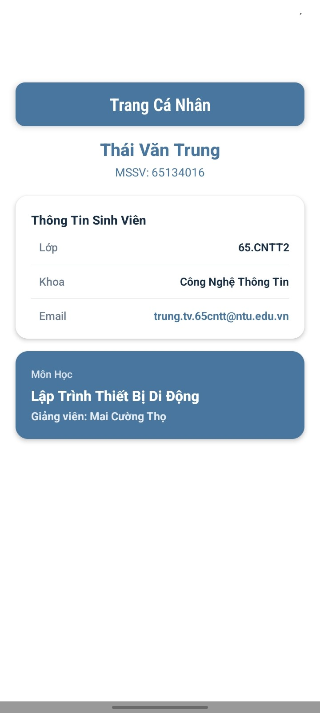

---
## ListView: Danh Sách Vật Liệu

[Chi tiết bài tập](https://github.com/azullshin1109/65134016_AndroidProgramming/tree/main/ListView_DSVatLieu/app/src/main/java/com/thaivantrung/listview_dsvatlieu) | [Layout](https://github.com/azullshin1109/65134016_AndroidProgramming/tree/main/ListView_DSVatLieu/app/src/main/res/layout)

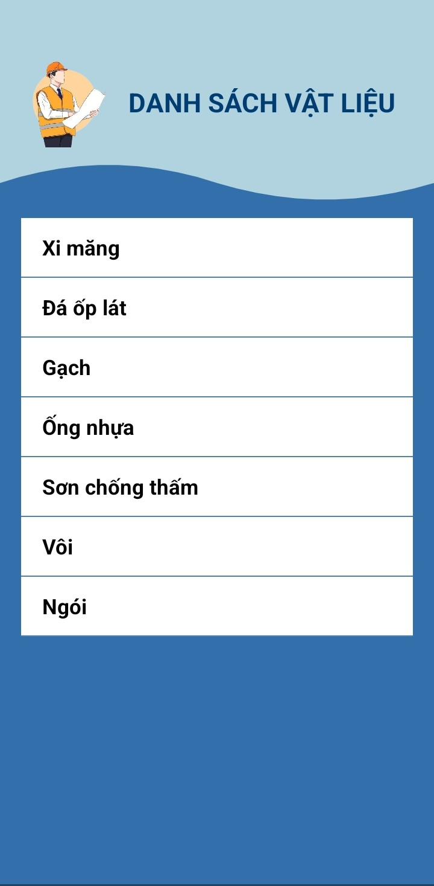

---

## ListView: Danh Sách Món Ăn

[Chi tiết bài tập](https://github.com/azullshin1109/65134016_AndroidProgramming/tree/main/ListView_DanhMucMonAn/app/src/main/java/com/thaivantrung/listview_danhmucmonan) | [Layout](https://github.com/azullshin1109/65134016_AndroidProgramming/tree/main/ListView_DanhMucMonAn/app/src/main/res/layout)

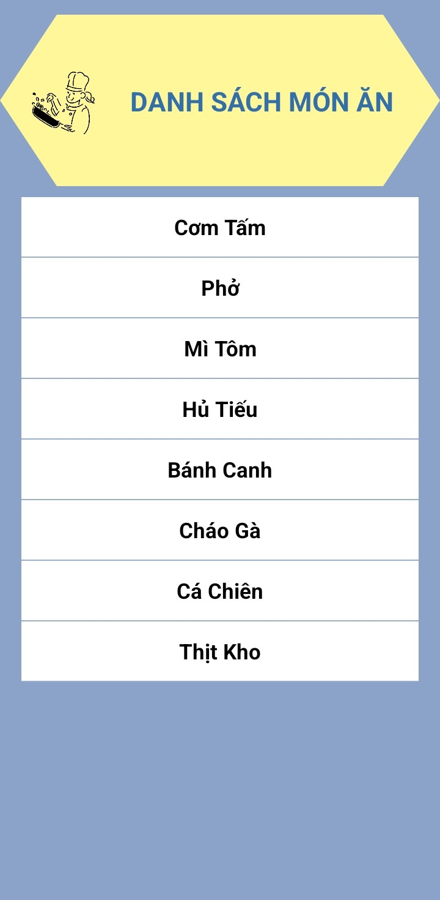

---

## *Mục lưu trữ bài tập thực hành:* 

## Bài Thực Hành 13: Thay đổi Fragment

[Chi tiết bài thực hành](https://github.com/azullshin1109/65134016_AndroidProgramming/blob/main/BaiTH13_ThayDoiFragment/app/src/main/java/com/thaivantrung/baith13_thaydoifragment/FooterFragment.java) | [Layout](https://github.com/azullshin1109/65134016_AndroidProgramming/tree/main/BaiTH13_ThayDoiFragment/app/src/main/res/layout)

  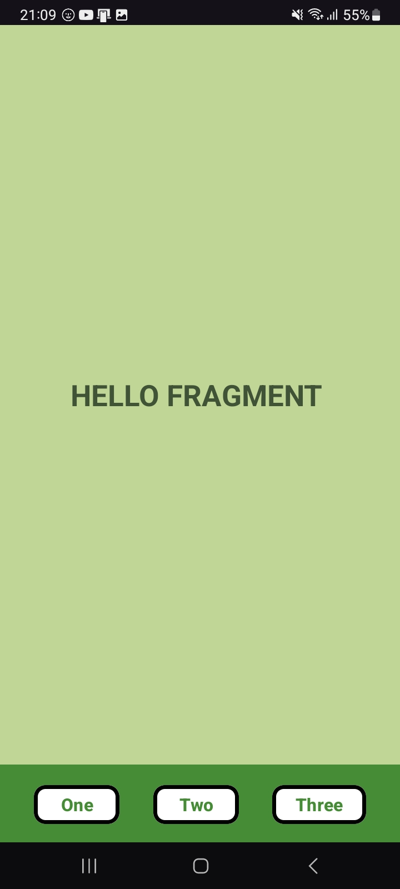
  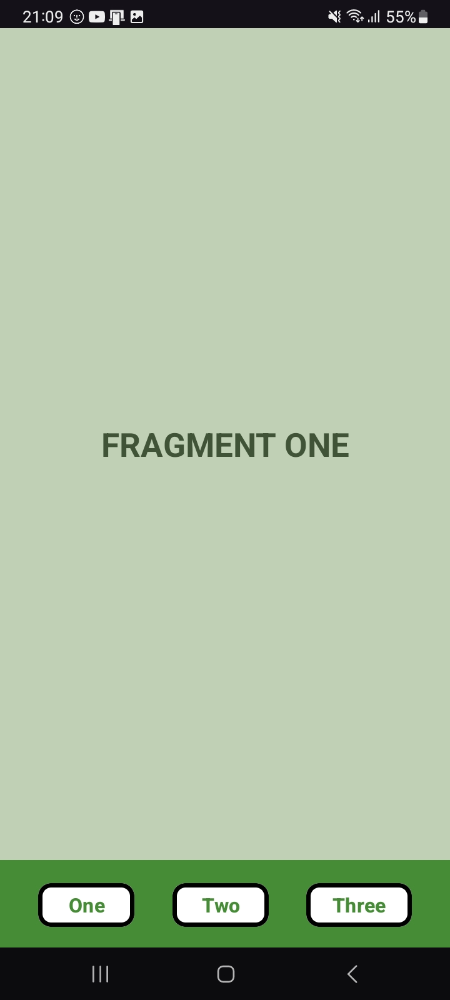
  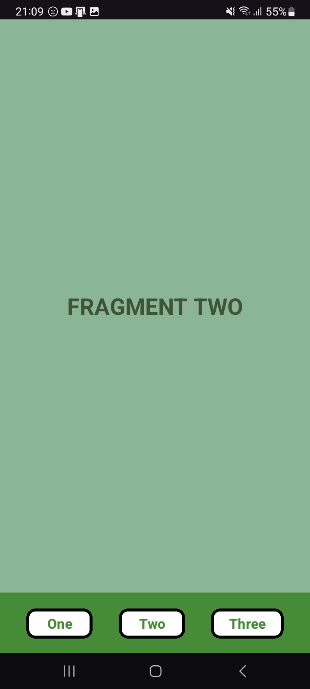
  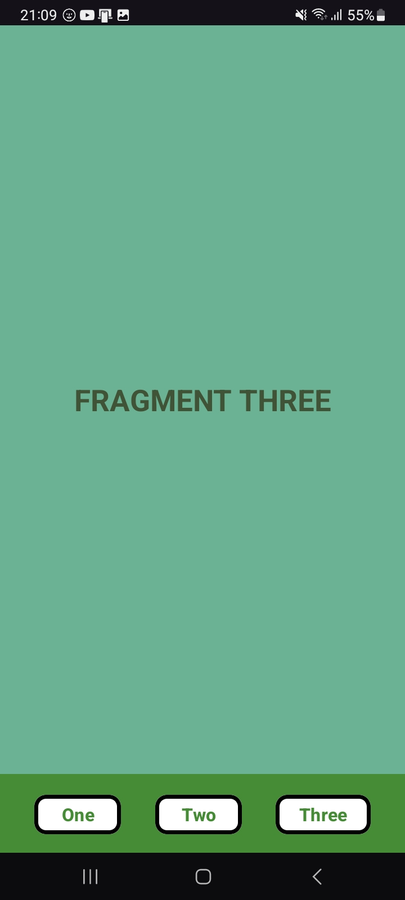

---

## Bài Thực Hành 12: Fragment Dynamic

[Chi tiết bài thực hành](https://github.com/azullshin1109/65134016_AndroidProgramming/tree/main/BaiTH12_FragmentDynamic/app/src/main/java/com/thaivantrung/baith12_fragmentdynamic) | [Layout](https://github.com/azullshin1109/65134016_AndroidProgramming/tree/main/BaiTH12_FragmentDynamic/app/src/main/res/layout)

  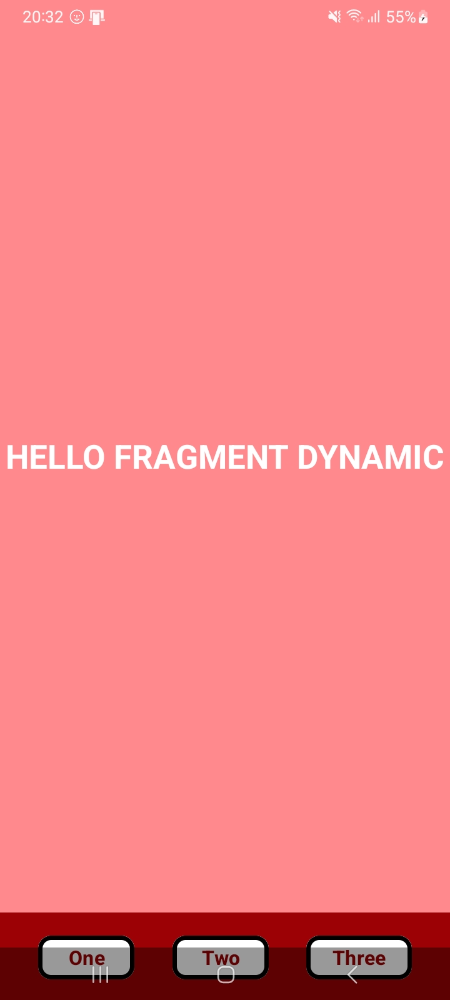

---

## Bài Thực Hành 11: Fragment

[Chi tiết bài thực hành](https://github.com/azullshin1109/65134016_AndroidProgramming/tree/main/BaiTH11_FragmentTinh/app/src/main/java/com/thaivantrung/baith11_fragmenttinh) | [Layout](https://github.com/azullshin1109/65134016_AndroidProgramming/tree/main/BaiTH11_FragmentTinh/app/src/main/res/layout)

  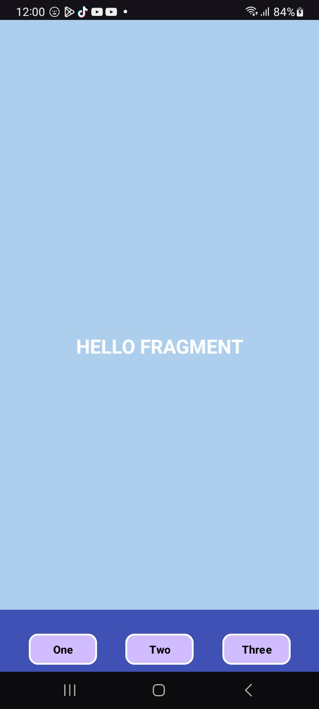

---

## Bài Thực Hành 10: Ví dụ Intent Đơn Giản

[Chi tiết bài thực hành](https://github.com/azullshin1109/65134016_AndroidProgramming/tree/main/BaiTH10_ViduIntentDonGian/app/src/main/java/com/thaivantrung/baith10_viduintentdongian) | [Layout](https://github.com/azullshin1109/65134016_AndroidProgramming/tree/main/BaiTH10_ViduIntentDonGian/app/src/main/res/layout)

  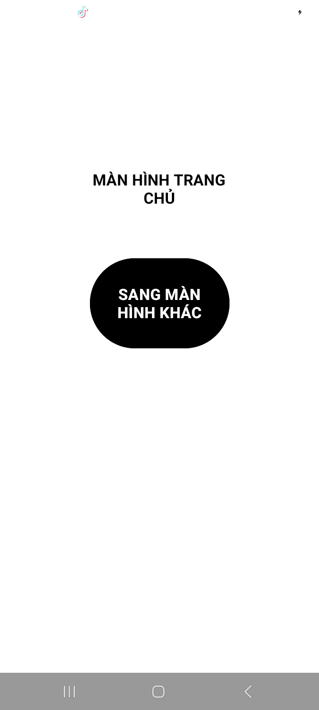
  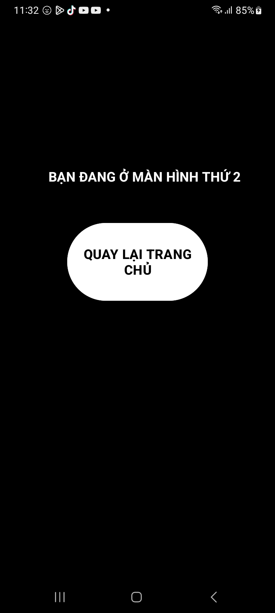

---

## Bài Thực Hành 9: Recyclerview

[Chi tiết bài thực hành](https://github.com/azullshin1109/65134016_AndroidProgramming/tree/main/BaiTH9_Recyclerview/app/src/main/java/com/thaivantrung/baith9_recyclerview) | [Layout](https://github.com/azullshin1109/65134016_AndroidProgramming/tree/main/BaiTH9_Recyclerview/app/src/main/res/layout)

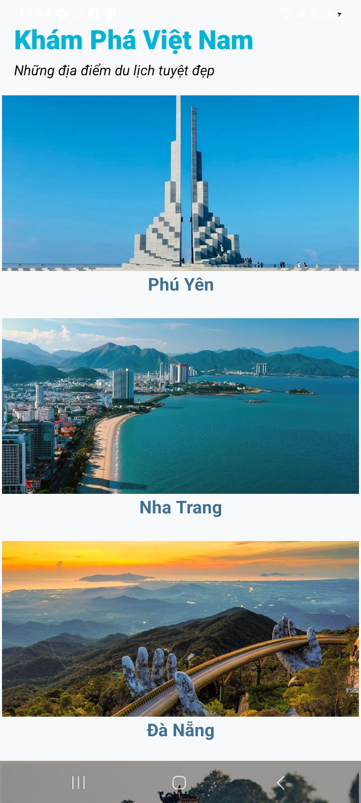

---

## Bài Thực Hành 8: Tùy Chỉnh ListView

[Chi tiết bài thực hành](https://github.com/azullshin1109/65134016_AndroidProgramming/tree/main/BaiTH8_TuyChinhLV/app/src/main/java/com/thaivantrung/baith8_tuychinhlv) | [Layout](https://github.com/azullshin1109/65134016_AndroidProgramming/tree/main/BaiTH8_TuyChinhLV/app/src/main/res/layout)

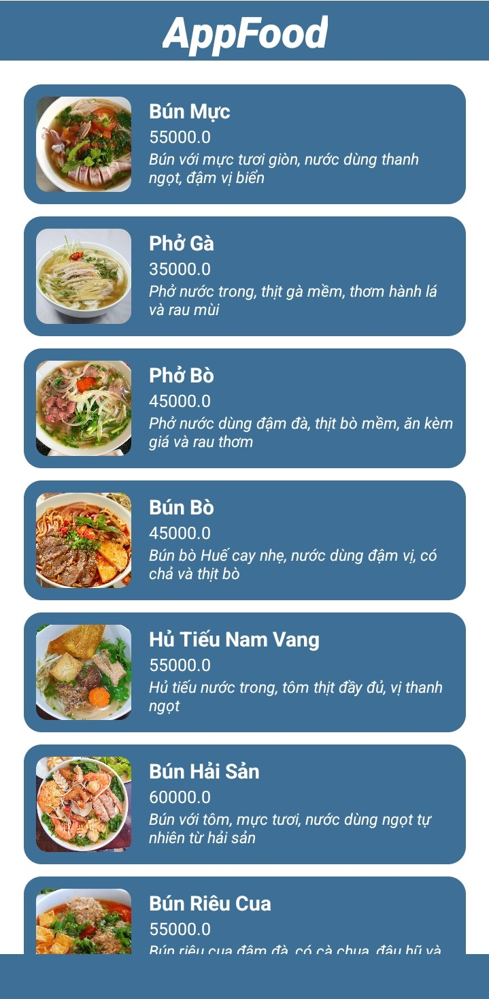

---

## Bài Thực Hành 7: Xây dựng các tỉnh thành

[Chi tiết bài thực hành](https://github.com/azullshin1109/65134016_AndroidProgramming/blob/main/ListView_XayDungCacTinhThanh/app/src/main/java/com/thaivantrung/listview_xaydungcactinhthanh/MainActivity.java) | [Layout](https://github.com/azullshin1109/65134016_AndroidProgramming/tree/main/ListView_XayDungCacTinhThanh/app/src/main/res/layout)

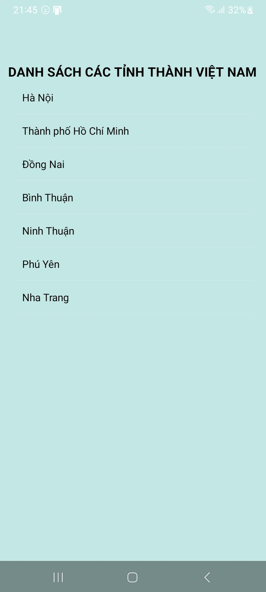

---

## Bài Thực Hành 6: Xử lý sự kiện tính tổng

[Chi tiết bài thực hành](https://github.com/azullshin1109/65134016_AndroidProgramming/blob/main/BaiTH6_XuLySuKien_TinhTong/app/src/main/java/com/thaivantrung/baith6_xulysukien_tinhtong/MainActivity.java) | [Layout](https://github.com/azullshin1109/65134016_AndroidProgramming/blob/main/BaiTH6_XuLySuKien_TinhTong/app/src/main/res/layout/activity_main.xml)

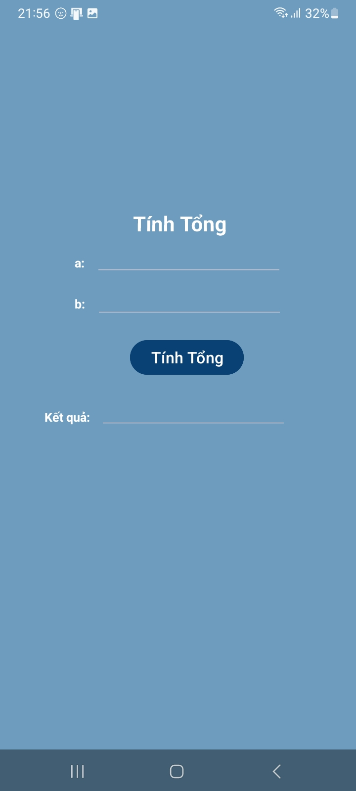

---

## Bài Thực Hành 5: Xử lý sự kiện 1

[Chi tiết bài thực hành](https://github.com/azullshin1109/65134016_AndroidProgramming/blob/main/BaiTH5_XuLySuKien1/app/src/main/java/com/thaivantrung/baith5_xulysukien1/MainActivity.java) | [Layout](https://github.com/azullshin1109/65134016_AndroidProgramming/tree/main/BaiTH5_XuLySuKien1/app/src/main/res/layout)

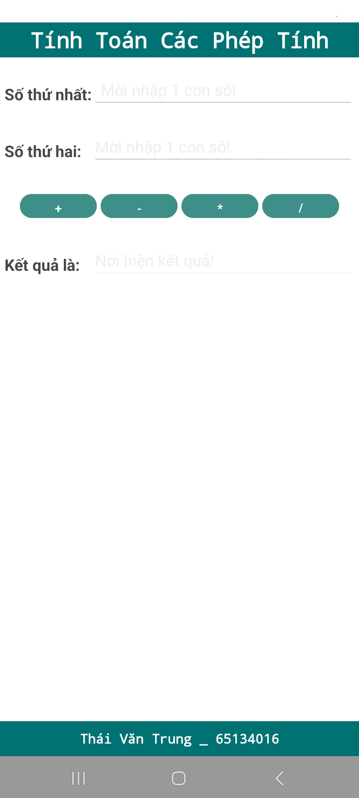

---

